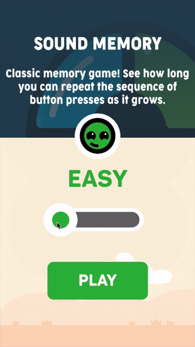
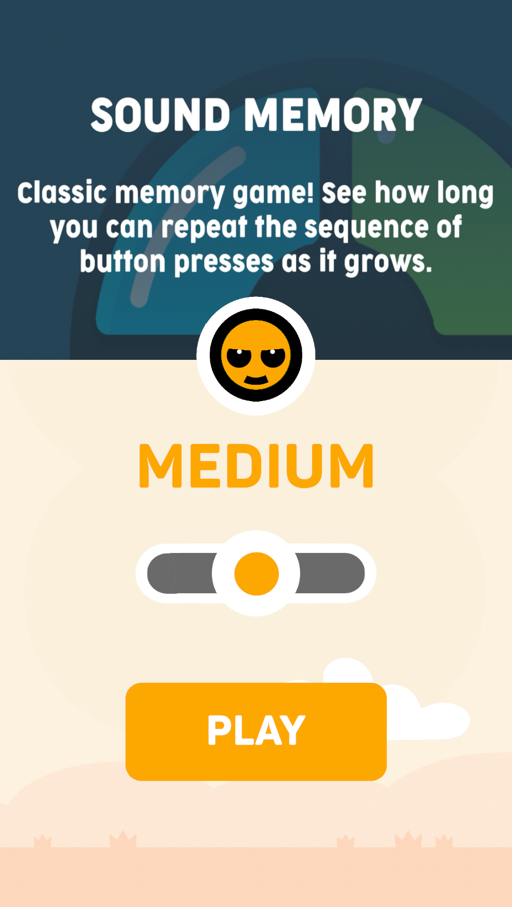
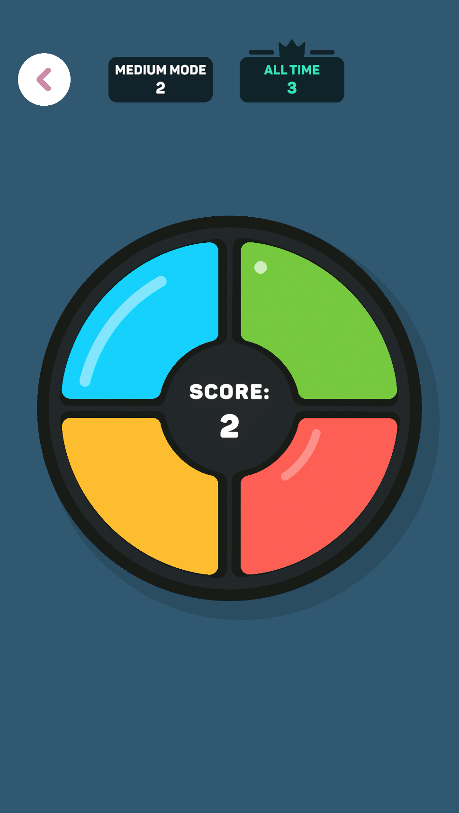
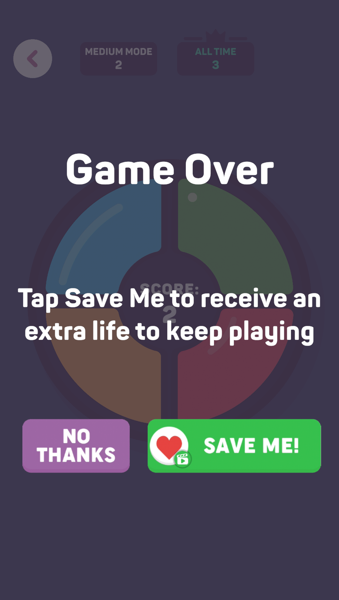
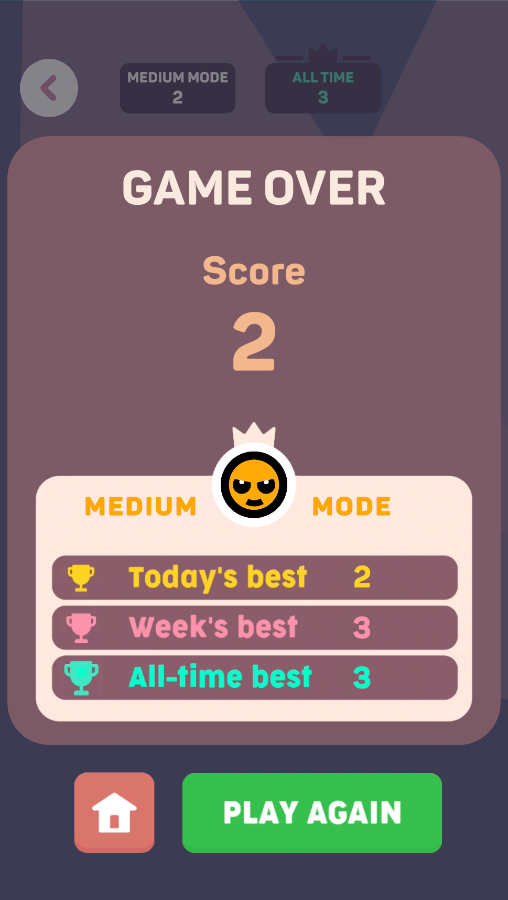

# 🎮 Simon Says Game

A technical test project for the Unity Developer position at Maliyo Games.

## 📋 Overview

A faithful replica of the "Sound Memory" game from Maliyo Games' "Offline Games" collection. This implementation recreates the classic "Simon Says" memory game experience in Unity, featuring three difficulty modes, persistent high score tracking, and polished UI/UX.

### 🎮 [Play in Browser](https://sleepyjohnestes.itch.io/maliyo-test)
**Password required:** `maliyo`

<p align="center">
  
</p>

## 📸 Screenshots

<p align="center">
  
  
  
  
</p>

## ✨ Features

### Game Modes
- **Easy**: 3 buttons (Blue, Green, Red)
- **Medium**: 4 buttons (Blue, Green, Yellow, Red) - single presses
- **Hard**: 4 buttons with 30% chance of simultaneous presses + rotating board animation

### Core Systems
- Persistent high score tracking (all-time, weekly, daily)
- Smooth scene transitions with fade effects
- Complete audio system with button-specific sounds
- Custom rounded corners shader for modern UI
- Animated UI panels and HUD

## 🛠️ Technologies

- **Unity**: 6000.0.58f2
- **Rendering**: Universal Render Pipeline (URP)
- **UI**: TextMesh Pro
- **Input**: New Input System
- **Language**: C#

## 📁 Project Structure

```
Assets/
├── Scripts/
│   ├── Game/              # Core game logic and UI
│   ├── Menu/              # Menu and difficulty selection
│   ├── SceneFade/         # Scene transition system
│   └── SoundManager/      # Audio management with pooling
├── Scenes/                # Menu and Game scenes
├── Sprites/               # Visual assets
├── Audio/                 # Sound effects
└── Shaders/               # Custom UI shaders
```

## 🎯 How to Play

1. Select a difficulty level
2. Watch the button sequence
3. Repeat the sequence in the same order
4. Each round adds one more step
5. Try to beat your high score!

## 🚀 Setup

### Requirements
- Unity 6000.0.58f2 or later

### Steps
1. Clone the repository
2. Open the project in Unity Hub
3. Open `Assets/Scenes/Menu.unity`
4. Press Play

## 🏗️ Architecture Highlights

- **Singleton Pattern**: Persistent managers (SoundManager, SceneFadeManager)
- **State Machine**: Game state control (Idle, ShowingSequence, WaitingForPlayerInput, GameOver)
- **Object Pooling**: Optimized audio source management
- **JSON Serialization**: Local high score persistence
- **ScriptableObjects**: Centralized configuration data

## 📊 Data Storage

High scores are saved locally at:
```
Application.persistentDataPath/highscores.json
```

---

**Technical Test Project** - Unity Developer Position
**Company**: Maliyo Games
